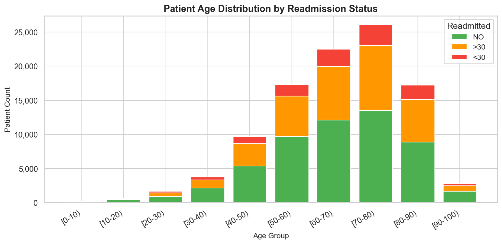
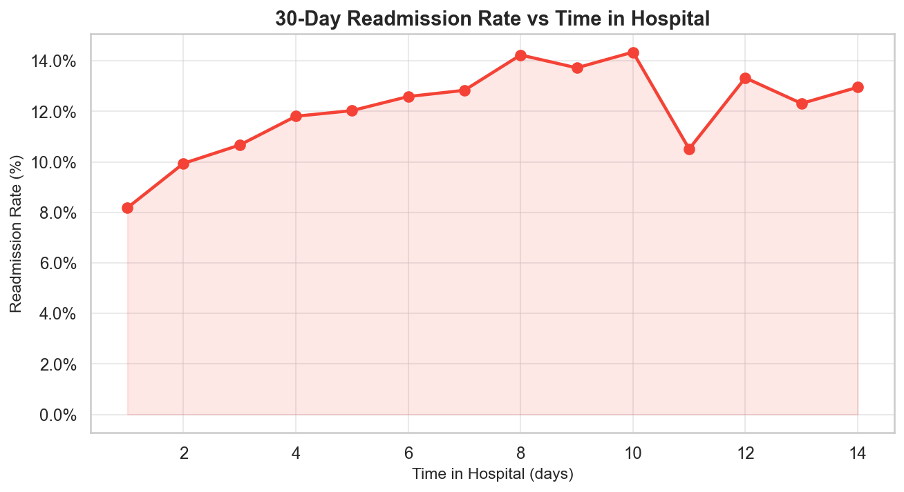
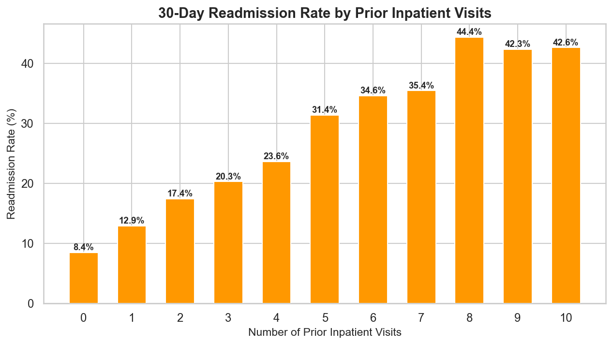

# 🏥 Patient Readmission Risk with Explainability Report

A production-scale, end-to-end machine learning pipeline that predicts 30-day hospital readmission risk for diabetic patients using the UCI Diabetes 130-US Hospitals dataset (101,766 records).


## 🌐 Live Demo
**[▶ Try the live Gradio app on Hugging Face Spaces](https://huggingface.co/spaces/harshith68/Patient-Readmission-Risk)**

> Enter patient clinical parameters → get 30-day readmission risk score + SHAP explanation


## 🎯 Project Highlights
- **SQL Cohort Profiling** — 10 clinical readmission queries via SQLite
- **Feature Engineering** — ICD-9 bucketing, medication change scoring, SMOTE balancing
- **Gradient Boosted Classifier** — XGBoost with stratified cross-validation
- **Hypothesis Testing** — Chi-square & t-tests on key risk factors
- **Explainability** — SHAP (global + local) + LIME (patient-level)
- **Clinical Report** — Auto-generated PDF with confusion matrix, SHAP plots, recommendations


## 🚀 Run Full Pipeline

```bash
# Install dependencies
pip3 install -r requirements.txt --break-system-packages

# Run complete pipeline (downloads data, trains model, generates report)
python3 main.py

# Run test suite
pytest tests/ -v
```

## 🗺️ Pipeline Architecture

```
main.py
  ├── [1] src/ingestion/load_data.py   → UCI download + SQLite profiling
  ├── [2] src/ingestion/eda.py         → 8 EDA figures
  ├── [3] src/features/engineer.py     → Feature engineering + splits
  ├── [4] src/modeling/train.py        → XGBoost + hypothesis tests
  ├── [5] src/explainability/explain.py→ SHAP + LIME
  └── [6] src/reporting/report.py      → Clinical PDF report
```


## 🗂️ Project Structure
```
patient-readmission-risk/
├── config/           # YAML configuration
├── data/             # Raw + processed data (gitignored)
├── logs/             # Per-module rotating logs (gitignored)
├── reports/          # SQL profiling, figures, clinical PDF
├── src/
│   ├── ingestion/    # Data download + SQL profiling
│   ├── features/     # Feature engineering + SMOTE
│   ├── modeling/     # XGBoost training + hypothesis tests
│   ├── explainability/ # SHAP + LIME
│   ├── reporting/    # Clinical PDF report
│   └── utils/        # Logger
├── tests/            # Pytest test suite
└── main.py           # Full pipeline orchestrator
```

## ⚙️ Setup & Run

```bash
# Install dependencies
pip3 install -r requirements.txt --break-system-packages

# Run full pipeline
python3 main.py

# Run tests
pytest tests/ -v
```

## 🛠️ Tech Stack
- **Python 3.14** | **XGBoost** | **scikit-learn** | **imbalanced-learn (SMOTE)**
- **SHAP** | **LIME** | **SciPy** | **SQLite** | **ReportLab**
- **pandas** | **matplotlib** | **seaborn**


## 📈 Sample EDA Outputs

| Class Distribution | Readmission by Age |
|---|---|
|  |  |

| Readmission vs Hospital Stay | Readmission vs Prior Visits |
|---|---|
|  |  |


## 📊 Dataset
UCI ML Repository — [Diabetes 130-US Hospitals (1999–2008)](https://archive.ics.uci.edu/dataset/296/diabetes+130-us+hospitals+for+years+1999-2008)
101,766 records | 47 features | Target: 30-day readmission

## 📁 Data
Raw data is not committed. Run `python3 main.py` to auto-download from UCI.


---

## Collaboration and Acknowledgements
This project was built and developed in collaboration with [Shruti Kumari](https://github.com/shrutisurya108).


## 👤 Authors
- [Harshith Bhattaram](https://github.com/maniharshith68)
- [Shruti Kumari](https://github.com/shrutisurya108)


